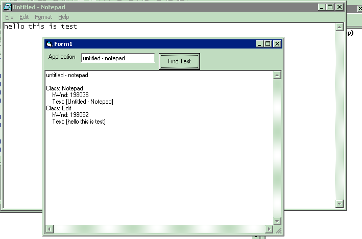

<div align="center">

## get text of other application


</div>

### Description

gets text from other application
 
### More Info
 


<span>             |<span>
---                |---
**Submitted On**   |2003-10-28 13:43:10
**By**             |[Sahir ](https://github.com/Planet-Source-Code/PSCIndex/blob/master/ByAuthor/sahir.md)
**Level**          |Intermediate
**User Rating**    |5.0 (10 globes from 2 users)
**Compatibility**  |VB 6\.0
**Category**       |[Windows System Services](https://github.com/Planet-Source-Code/PSCIndex/blob/master/ByCategory/windows-system-services__1-35.md)
**World**          |[Visual Basic](https://github.com/Planet-Source-Code/PSCIndex/blob/master/ByWorld/visual-basic.md)
**Archive File**   |[get\_text\_o170614292004\.zip](https://github.com/Planet-Source-Code/sahir-get-text-of-other-application__1-51612/archive/master.zip)

### API Declarations

```

Private Declare Function GetWindow Lib "user32" (ByVal hwnd As Long, ByVal wCmd As Long) As Long
Private Declare Function FindWindow Lib "user32" Alias "FindWindowA" (ByVal lpClassName As String, ByVal lpWindowName As String) As Long
Private Declare Function GetClassName Lib "user32" Alias "GetClassNameA" (ByVal hwnd As Long, ByVal lpClassName As String, ByVal nMaxCount As Long) As Long
Private Declare Function SendMessage Lib "user32" Alias "SendMessageA" (ByVal hwnd As Long, ByVal wMsg As Long, ByVal wParam As Long, lParam As Any) As Long
```


